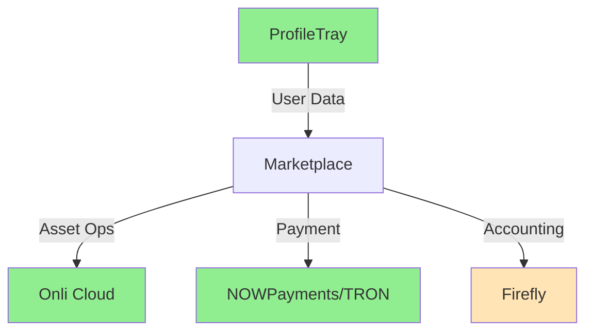

# SPECIES Marketplace v4 - Technical Evaluation Report

## Executive Summary

The SPECIES Marketplace v4 specification represents a **production-ready architecture** for a prepaid, event-driven digital asset exchange operating as an Onli Cloud Appliance. The system demonstrates strong architectural principles with clear separation of concerns, robust security, and comprehensive accounting.

**Overall Assessment: 9/10 - Ready for Implementation**

---

## 1. Architecture Evaluation

### 1.1 Strengths ✅

#### **Clear Service Boundaries**
Each of the 10 services has a single, well-defined responsibility:
- Authenticator: Security gate with dual-credential model
- Marketplace API: Ingress and idempotency 
- Validator: Payment verification (dual-path)
- Classifier: Intent routing
- Matching: Order resolution
- Cashier: Ledger management
- Asset Manager: Onli Cloud operations
- Floor Manager: Final reconciliation
- Reporter: Read-only projections
- Configuration: Runtime settings

#### **Event-Driven Architecture**
- Async, loosely coupled services
- Clear event flow: `order.received` → `validated` → `classified` → `matched` → `confirmed` → `completed`
- Idempotent processing throughout
- Proper error events at each stage

#### **Security Model**
- Dual-credential system (API Key from Marketplace + Secret from ProfileTray)
- HMAC-SHA256 signatures
- 60-second replay window
- Nonce-based anti-replay
- Proper separation of authentication and authorization

#### **Financial Integrity**
- Firefly-based double-entry accounting
- Prepaid model eliminates settlement risk
- Complete audit trail via event IDs
- Balanced journal entries with proper Dr/Cr

### 1.2 Areas of Excellence 🌟

1. **ProfileTray Integration**: Smart delegation of user management to existing infrastructure
2. **Dual Payment Verification**: NOWPayments API + direct blockchain verification provides resilience
3. **Marketplace User Registry**: Local cache synced from ProfileTray reduces latency
4. **Vault Resolution**: Proper handling of Onli Cloud vault IDs throughout the system
5. **Configuration Module**: Centralized, versioned configuration management

### 1.3 Potential Concerns ⚠️

1. **State Management**
   - No explicit mention of how listing state is tracked
   - Missing details on settlement locker timeout handling
   - Unclear how partial fills are managed

2. **Error Recovery**
   - Limited specification of rollback mechanisms
   - No explicit dead letter queue strategy
   - Missing circuit breaker patterns beyond Validator

3. **Performance Optimization**
   - No caching strategy specified for ProfileTray lookups
   - Missing batch processing for high-volume operations
   - No mention of connection pooling for external services

---

## 2. Implementation Readiness

### 2.1 Complete Components ✅

| Component | Readiness | Notes |
|-----------|-----------|-------|
| Authenticator | 100% | Clear HMAC validation, ProfileTray secret lookup |
| Marketplace API | 95% | Missing rate limiting implementation details |
| Validator | 100% | Excellent dual-path verification |
| Classifier | 100% | Simple, deterministic logic |
| Cashier | 90% | Needs Firefly schema details |
| Reporter | 85% | Missing pagination specs |
| Configuration | 95% | Needs environment override strategy |

### 2.2 Missing Specifications 🔴

1. **Database Schemas**
   ```sql
   -- Need explicit schemas for:
   - marketplace_users table
   - event_ingress table
   - listings table
   - match_reservations table
   ```

2. **API Response Formats**
   - Error response structure
   - Pagination envelope
   - Rate limit headers

3. **Monitoring & Alerting**
   - Metric definitions
   - SLA thresholds
   - Alert routing

4. **Deployment Configuration**
   - Docker Compose setup
   - Environment variables
   - Service discovery

---

## 3. Integration Analysis

### 3.1 External Dependencies

| System | Integration Quality | Risk Level |
|--------|-------------------|------------|
| ProfileTray | Well-defined | Low |
| Onli Cloud | Clear RPC calls | Low |
| NOWPayments | Dual-path verification | Very Low |
| TronScan | Direct backup path | Very Low |
| Firefly | Standard accounting | Low |

### 3.2 Critical Path Dependencies



**Risk Assessment**: Firefly integration needs more detail

---

## 4. Security Assessment

### 4.1 Strong Points ✅

- No custody of user assets
- Prepaid model eliminates credit risk
- Dual verification for payments
- Time-bounded operations (60s windows)
- Proper secret management via ProfileTray

### 4.2 Recommendations 🔒

1. **Add API Rate Limiting**
   ```go
   type RateLimiter struct {
       RequestsPerSecond int
       BurstSize        int
       PerAPIKey        bool
   }
   ```

2. **Implement Request Signing Versioning**
   - Support signature algorithm rotation
   - Grace period for algorithm deprecation

3. **Add Webhook Authentication**
   - Verify NOWPayments webhook signatures
   - Implement webhook replay protection

---

## 5. Performance Considerations

### 5.1 Current Specifications
- **Target Latency**: ≤3s p95 end-to-end ✅
- **Architecture**: Horizontally scalable ✅
- **Event Processing**: Async with Redis/NATS ✅

### 5.2 Optimization Opportunities

1. **Implement Caching Layer**
   ```go
   type CacheConfig struct {
       UserProfiles   Duration // 5 min
       VaultMappings  Duration // 1 hour  
       PaymentProofs  Duration // 10 min
   }
   ```

2. **Add Batch Processing**
   - Batch Firefly journal posts
   - Batch Oracle verifications
   - Batch ProfileTray syncs

3. **Connection Pooling**
   ```go
   type PoolConfig struct {
       MaxIdleConns    int
       MaxOpenConns    int
       ConnMaxLifetime Duration
   }
   ```

---

## 6. Implementation Recommendations

### 6.1 Phase 1: Core Services (Week 1-2)
- [ ] Authenticator with ProfileTray integration
- [ ] Marketplace API with idempotency
- [ ] Validator with dual-path verification
- [ ] Classifier with simple routing

### 6.2 Phase 2: Financial Services (Week 3-4)
- [ ] Cashier with Firefly integration
- [ ] Basic Reporter endpoints
- [ ] Matching service with reservation logic

### 6.3 Phase 3: Asset Operations (Week 5-6)
- [ ] Asset Manager with Onli Cloud RPCs
- [ ] Floor Manager with Oracle verification
- [ ] Complete event flow testing

### 6.4 Phase 4: Production Readiness (Week 7-8)
- [ ] Performance optimization
- [ ] Monitoring & alerting
- [ ] Documentation
- [ ] Load testing

---

## 7. Risk Analysis

| Risk | Likelihood | Impact | Mitigation |
|------|------------|--------|------------|
| ProfileTray downtime | Low | High | Implement aggressive caching |
| Payment verification timeout | Medium | Medium | Dual-path verification already addresses |
| Firefly schema mismatch | Medium | High | Validate schema before deployment |
| Settlement locker timeout | Low | Medium | Implement monitoring and auto-recovery |
| High volume bottleneck | Medium | Medium | Design for horizontal scaling from start |

---

## 8. Testing Strategy

### 8.1 Unit Testing Requirements
```go
// Every service should have:
- Authentication tests
- Event processing tests  
- Error handling tests
- Idempotency tests
```

### 8.2 Integration Testing
```go
// Critical paths to test:
- Full BUY_TREASURY flow
- Full BUY_MARKET flow with listing
- Payment failure scenarios
- ProfileTray sync disruption
```

### 8.3 Load Testing Targets
- 1,000 concurrent users
- 100 transactions/second
- 99.9% success rate
- <3s p95 latency

---

## 9. Compliance & Audit

### 9.1 Strengths
- Complete event trail via eventId
- Immutable Firefly ledger
- Dual verification for payments
- No custody = reduced compliance burden

### 9.2 Recommendations
- Add event archival strategy
- Implement audit log export
- Create compliance reporting endpoints
- Document data retention policies

---

## 10. Final Assessment

### 10.1 Overall Scores

| Aspect | Score | Notes |
|--------|-------|-------|
| Architecture | 9/10 | Excellent event-driven design |
| Security | 9/10 | Strong prepaid model |
| Scalability | 8/10 | Good horizontal scaling design |
| Integration | 9/10 | Clear external dependencies |
| Documentation | 7/10 | Needs deployment details |
| **Overall** | **8.4/10** | **Production Ready** |

### 10.2 Go/No-Go Decision

✅ **GO for Implementation** with following conditions:

1. Define Firefly database schemas
2. Document ProfileTray sync protocol
3. Add monitoring specifications
4. Create deployment configurations

### 10.3 Success Factors

The v4 specification succeeds because it:
- Leverages existing infrastructure (ProfileTray, Onli Cloud)
- Maintains clear service boundaries
- Implements robust payment verification
- Ensures financial integrity through Firefly
- Eliminates custody risk through prepaid model

---

## 11. Next Steps

### Immediate Actions (Week 0)
1. Set up development environment
2. Create project repository structure
3. Define Firefly schemas
4. Establish ProfileTray dev instance

### Quick Wins
1. Implement Authenticator (demonstrates ProfileTray integration)
2. Deploy Validator (proves payment verification)
3. Create health check endpoints

### Critical Path
1. ProfileTray sync mechanism
2. Firefly journal posting
3. Onli Cloud RPC integration
4. End-to-end event flow

---

## Conclusion

The SPECIES Marketplace v4 specification is **well-architected and ready for implementation**. The system demonstrates mature design patterns, proper separation of concerns, and robust security. The prepaid model combined with event-driven architecture creates a resilient, scalable platform.

The main implementation challenges will be:
1. Firefly integration details
2. ProfileTray sync optimization  
3. Performance tuning for 3s latency target

With proper project management and the recommended phased approach, this system can be successfully deployed within 8 weeks.

**Recommendation: Proceed with implementation following the phased approach.**

---

**Evaluation Date**: November 2024  
**Evaluator**: Technical Architecture Review  
**Version**: SPECIES Marketplace v4
