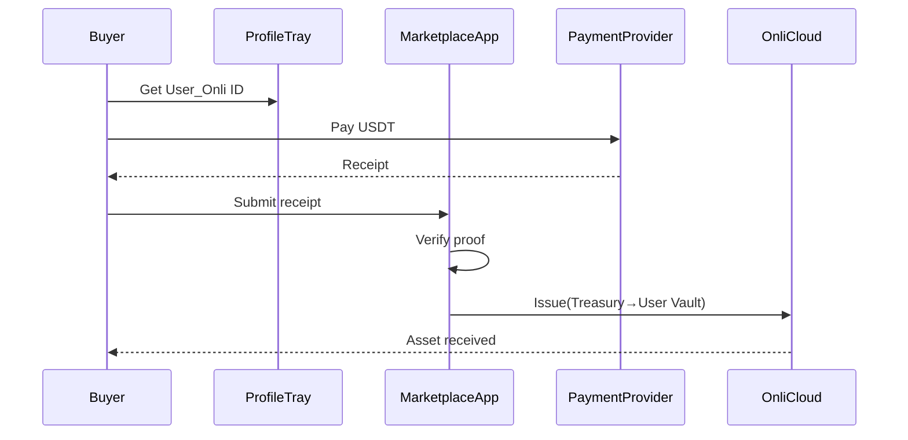
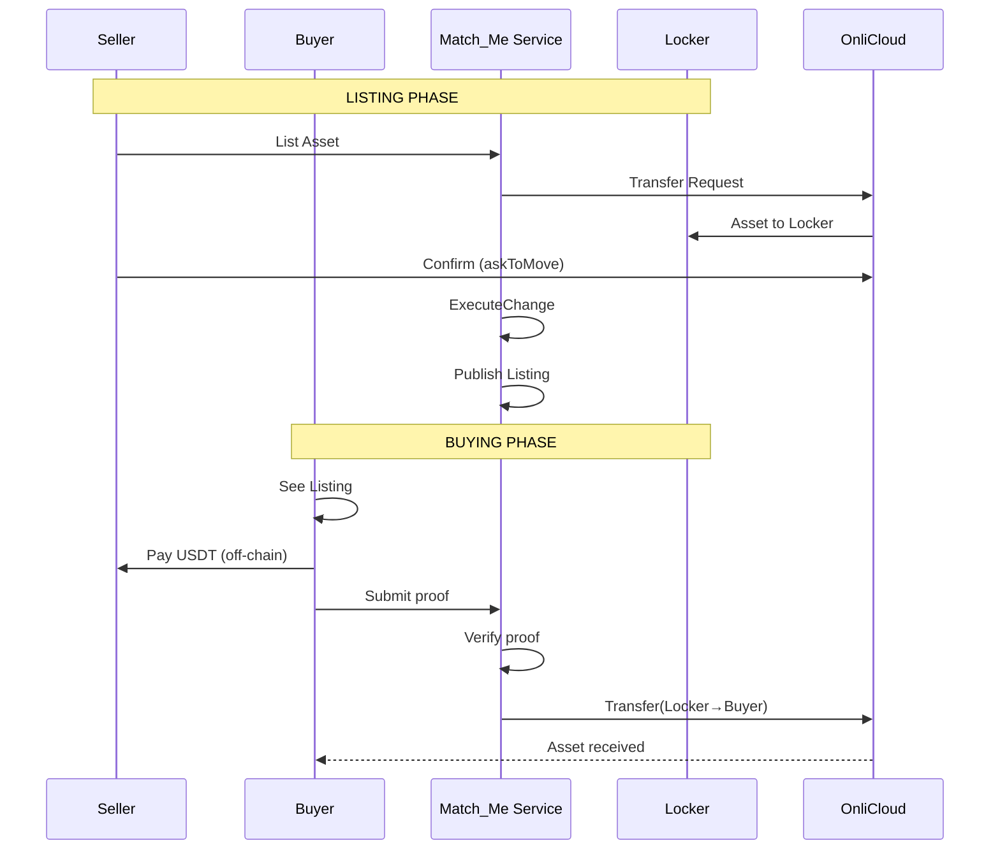

# SPECIES Marketplace - Transaction Logic Analysis (v5)

## Key Changes from Original Architecture

### 1. Actor Model Evolution

The updated model introduces a more sophisticated actor system with specific Onli IDs and vault concepts:

**Service Actors (System-Controlled):**
- **Treasurer** (Service_Onli ID) - Manages treasury operations
- **Match_Me** (Service_Onli ID) - Marketplace matching service  
- **LiquidityProvider** (Service_Onli ID) - Liquidity pool operations
- **Locker_ID** - Intermediate custody during transfers

**User Actors:**
- **User_Onli ID** - Individual users
- **Vault (Onli_ID)** - User's asset storage

### 2. Critical Logic Changes

#### A. Two-Phase Asset Movement Pattern
The new model introduces a **Locker Vault** as an intermediate state:
```
Original: Sender → Receiver (direct)
Updated:  Sender → Locker Vault → Receiver (two-phase)
```

**Rationale:** This provides atomic transaction safety and enables marketplace operations without direct peer-to-peer complexity.

#### B. Validation Types
Two distinct validation patterns:
1. **PreAuthorized**: System-initiated, automatic approval
2. **Live Confirm**: User-initiated, requires explicit consent

#### C. Payment Flow Separation
- **USDT payments** flow independently of asset transfers
- **Proof of payment** (receipt) validates the payment side
- **Asset movement** validated separately through Onli Cloud

### 3. Transaction Type Analysis

#### **ISSUE (Treasury → User)**
✅ **Logic Verified:**
- Payment: Buyer USDT → Assurance USDT Account
- Asset: Treasury Vault → User Vault
- Both sides PreAuthorized (system-controlled)
- Clean separation of payment and asset flows

#### **BUY (Marketplace)**
✅ **Logic Verified:**
- Payment: Buyer USDT → Seller USDT Account  
- Asset: Locker Vault → User Vault
- PreAuthorized because asset is already in Locker
- Seller already received notification in List phase

#### **LIST (For Sale)**
⚠️ **Logic Question:**
- No payment flow (null) - makes sense for listing
- Asset: Seller Vault → Locker Vault (Seller Onli_ID)
- Uses "askToMove-Live Confirm" 
- **Question:** Why is the Locker Vault associated with "Seller Onli_ID" instead of Match_Me service?

#### **SELL (Receive)**
✅ **Logic Verified:**
- This is the payment receipt side of BUY
- No asset movement (handled by BUY)
- Seller gets USDT notification/confirmation

#### **TRANSFER (P2P)**
✅ **Logic Verified:**
- No payment (true P2P gift/transfer)
- Asset: Sender → Locker → Receiver
- Both parties must confirm (Live Confirm)
- Clean two-phase movement through Locker

#### **REDEEM (P2LP - Sell to Liquidity Provider)**
✅ **Logic Verified:**
- Payment: Assurance USDT → Seller USDT
- Asset: Locker Vault → LiquidityProvider Vault
- PreAuthorized (system-to-system)
- Enables instant liquidity

### 4. API Flow Verification

#### Issue Flow


#### List/Buy Flow Complexity


### 5. Critical Observations

#### ✅ **Strengths of New Model:**
1. **Atomic Safety**: Locker pattern prevents partial transfers
2. **Clean Separation**: Payment and asset flows are independent
3. **Service Automation**: PreAuthorized flows for system operations
4. **User Sovereignty**: Live Confirm for user-initiated actions
5. **Liquidity Options**: P2LP enables instant liquidity

#### ⚠️ **Points Needing Clarification:**

1. **Locker Ownership Model:**
   - In LIST, why is Locker Vault associated with "Seller Onli_ID"?
   - Should it be Match_Me's ID since Match_Me controls it?

2. **Receipt Verification:**
   - How does the system verify USDT payment receipts?
   - What prevents fake receipts?

3. **Timing Considerations:**
   - What happens if buyer pays but asset transfer fails?
   - How long is a listing valid in the Locker?

4. **State Management:**
   - How does the system track asset state in Locker?
   - What prevents double-spending from Locker?

### 6. Recommended Clarifications for PRD

1. **Add Locker Service Definition:**
```typescript
interface LockerService {
  id: Service_Onli_ID;
  role: "Temporary custody for atomic transfers";
  capabilities: [
    "Auto-accept transfers",
    "Hold assets in escrow",
    "Execute pre-authorized transfers",
    "Maintain listing registry"
  ];
}
```

2. **Define Proof Verification:**
```typescript
interface PaymentProof {
  receipt_id: string;
  payment_provider: "NOWPayments" | "Hyperswitch";
  amount: number;
  from_address: string;
  to_address: string;
  confirmations: number;
  timestamp: string;
  signature: string;  // Provider signature
}
```

3. **Add State Diagram:**
```
Asset States:
USER_VAULT → LOCKER_PENDING → LOCKER_CONFIRMED → LOCKER_LISTED → BUYER_VAULT
                ↓ (timeout)
            USER_VAULT (return)
```

4. **Define Timeout Policies:**
- Listing expiration: 30 days
- Transfer confirmation window: 1 hour
- Payment verification timeout: 10 minutes

### 7. Integration with Original PRD Philosophy

The updated model actually **strengthens** the "Trust Without Chains" philosophy:

1. **Locker as Mathematical Certainty**: 
   - Not custody, but mathematical state transition
   - Temporary, deterministic, automated

2. **PreAuthorized as Sovereignty**:
   - Users pre-consent to system operations
   - No surprise movements, only expected flows

3. **Live Confirm as Liberation**:
   - Users maintain veto power
   - Consent is active, not passive

### 8. Summary of Required PRD Updates

**Section 5 (Functional Requirements):**
- Add Locker Service as core component
- Update transaction flows with two-phase movement
- Define PreAuthorized vs Live Confirm logic

**Section 6 (Technical Architecture):**
- Add Locker Service to microservices
- Update state management for Locker pattern
- Define timeout and rollback mechanisms

**Section 8 (Data Models):**
- Add Locker state to asset lifecycle
- Define proof verification schema
- Add vault concept to user model

**Section 9 (API Specifications):**
- Update with askToMove/askToReceive patterns
- Add ProfileTray integration points
- Define Locker management endpoints

---

## Conclusion

The v5 transaction logic is **sound and improves** upon the original design by:
1. Adding atomic safety through Locker pattern
2. Clearly separating payment and asset flows
3. Providing both automated and consensual transfer modes
4. Enabling advanced features like instant liquidity

The main clarification needed is around Locker ownership attribution in the LIST operation, and adding explicit timeout/rollback policies for incomplete transactions.

The model successfully maintains the "Trust Without Chains" philosophy while adding practical safety mechanisms that don't compromise sovereignty.
