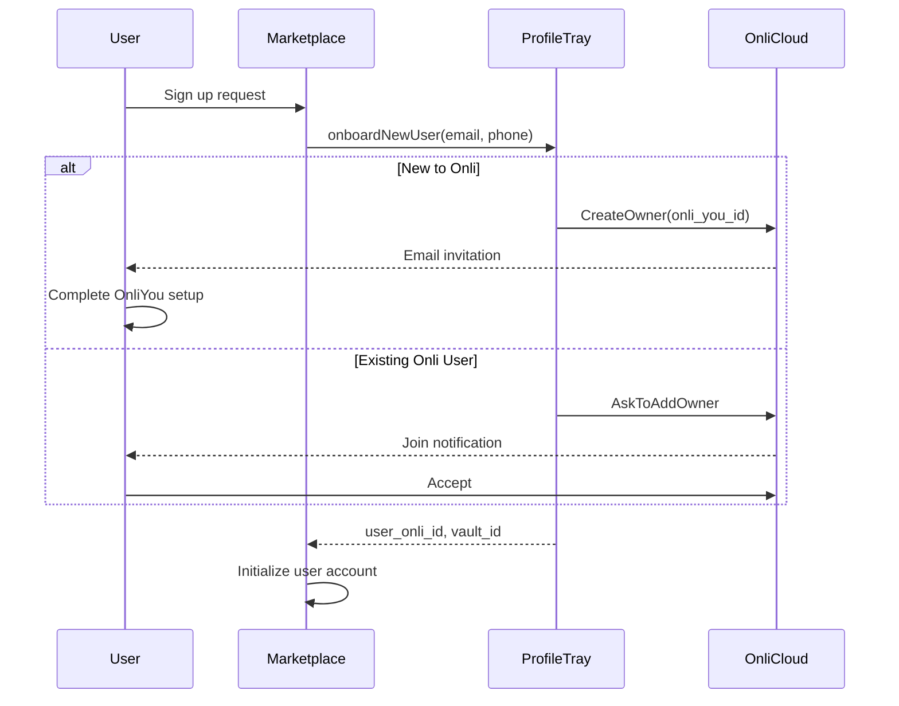
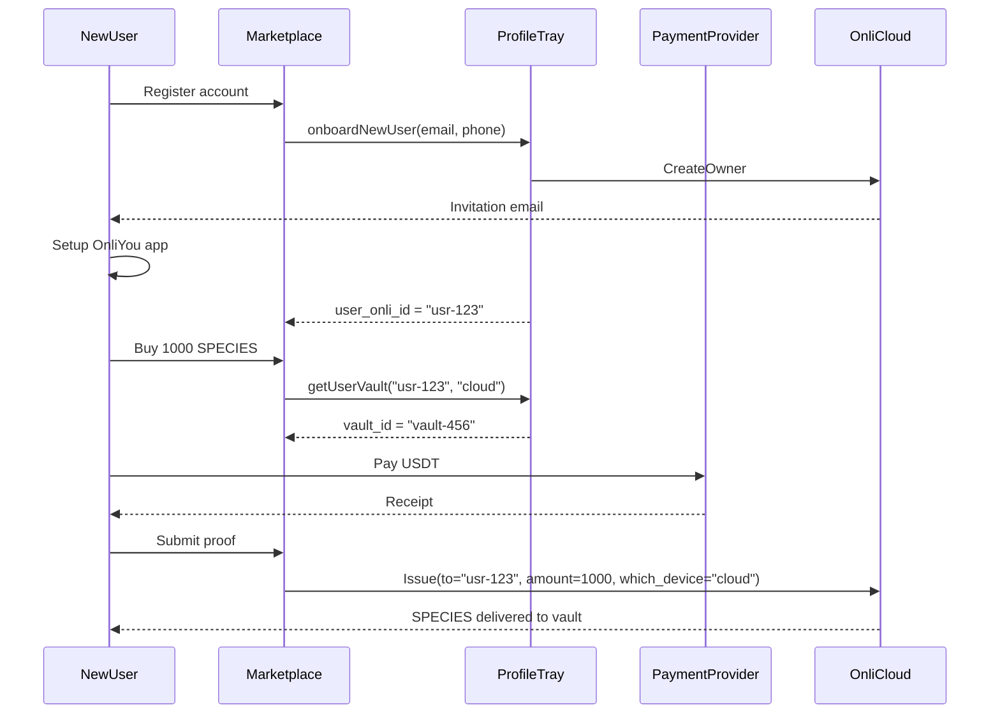
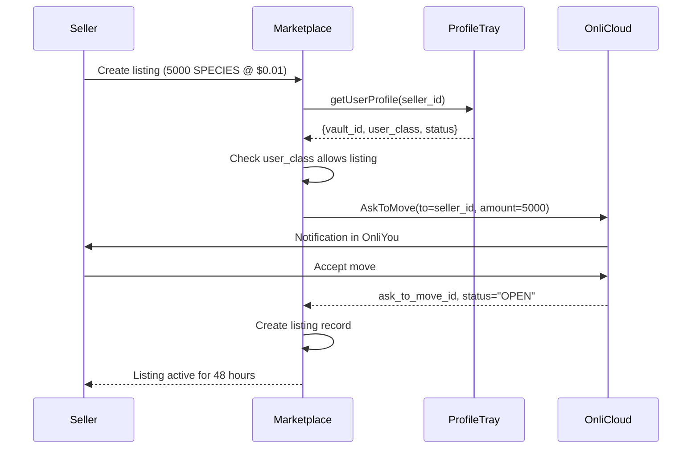

# SPECIES Marketplace - Complete Architecture
## As an Onli Cloud Appliance with ProfileTray Integration

---

## System Architecture Overview

```
┌─────────────────────────────────────────────────────────────┐
│                     SPECIES MARKETPLACE                       │
│                   (Onli Cloud Appliance)                     │
│                    App Symbol: SPECIES                       │
└─────────────────────────────┬───────────────────────────────┘
                              │
                              ├──────────────┐
                              ▼              ▼
┌─────────────────────────────────┐  ┌──────────────────────┐
│         ProfileTray              │  │   Payment Providers  │
│    (User Management Service)     │  │  - NOWPayments       │
│    - User Onboarding            │  │  - TronScan          │
│    - ID Management              │  │  - Hyperswitch       │
│    - Vault Association          │  └──────────────────────┘
└─────────────────────────┬───────┘
                          │
                          ▼
┌─────────────────────────────────────────────────────────────┐
│                        ONLI CLOUD                            │
│                                                              │
│  ┌──────────────┐  ┌──────────────┐  ┌──────────────┐      │
│  │  Owners API  │  │ Cloud API    │  │   Oracle     │      │
│  │              │  │              │  │              │      │
│  │ CreateOwner  │  │ Issue        │  │ RevealGenomes│      │
│  │ GetOwner     │  │ AskToMove    │  │              │      │
│  │ UpdateOwner  │  │ ChangeOwner  │  │              │      │
│  │ ListOwner    │  │ Authenticate │  │              │      │
│  └──────────────┘  │ Authorize    │  └──────────────┘      │
│                    │ AuthLog      │                         │
│                    └──────────────┘                         │
│                                                              │
│  ┌────────────────────────────────────────────────────┐     │
│  │            Settlement Infrastructure               │     │
│  │  - Settlement Lockers (48hr timeout)              │     │
│  │  - Treasury Vault                                 │     │
│  │  - User Vaults (Cloud/Mobile)                     │     │
│  └────────────────────────────────────────────────────┘     │
└─────────────────────────────────────────────────────────────┘
```

---

## 1. SPECIES as an Onli Cloud Appliance

### 1.1 Appliance Registration

```yaml
appliance:
  app_symbol: "SPECIES"
  app_key: "[provided_on_registration]"
  master_id: "[master_user_id]"
  
  user_classes:
    - trader      # Regular marketplace users
    - market_maker # Liquidity providers
    - admin       # Marketplace operators
  
  behaviors:
    - move        # Default - move assets to locker
    - trade       # Execute marketplace trades
    - list        # Create marketplace listings
    - redeem      # Instant liquidity operations
```

### 1.2 Service Architecture Layers

| Layer | Component | Responsibility |
|-------|-----------|---------------|
| **Application** | SPECIES Marketplace | Business logic, trade orchestration |
| **User Management** | ProfileTray | User onboarding, ID management |
| **Asset Infrastructure** | Onli Cloud | Asset operations, ownership |
| **Payment Rails** | External Providers | USDT verification |

---

## 2. ProfileTray Integration

### 2.1 Core Functions

ProfileTray handles all user-related operations for the SPECIES Appliance:

```typescript
interface ProfileTrayService {
  // User Onboarding
  onboardNewUser(params: {
    email: string;
    phone: string;
    onli_you_id?: string;  // For new Onli users
  }): Promise<{
    user_onli_id: string;
    vault_id: string;
    status: "invited" | "active";
  }>;
  
  // User Management
  getUserProfile(user_onli_id: string): Promise<{
    identity: UserIdentity;
    vaults: {
      cloud?: string;
      mobile?: string;
    };
    appliance_context: {
      SPECIES: {
        user_class: string;
        status: string;
        extra?: string;  // Custom marketplace data
      };
    };
  }>;
  
  // Vault Management
  getUserVault(user_onli_id: string, device: "cloud" | "mobile"): Promise<string>;
  
  // Bulk Operations
  listApplianceUsers(params: {
    user_class?: string;
    status?: string;
    limit: number;
  }): Promise<UserProfile[]>;
}
```

### 2.2 Server-to-Server Communication



### 2.3 User Data Model

```typescript
interface SPECIESUser {
  // From ProfileTray/Onli
  user_onli_id: string;           // e.g., "usr-319d53bc-cf9b-5cea-9ec7"
  vault_id: string;                // User's active vault
  onli_status: "invited" | "active";
  
  // SPECIES Marketplace specific
  marketplace_data: {
    user_class: "trader" | "market_maker" | "admin";
    kyc_status: "pending" | "verified";
    trading_limits: {
      daily_volume: number;
      single_transaction: number;
    };
    fee_tier: "standard" | "preferred" | "vip";
    created_at: string;
    last_active: string;
  };
  
  // Cached from ProfileTray
  cached_profile?: {
    email: string;
    username?: string;
    company?: string;
    last_updated: string;
  };
}
```

---

## 3. Complete Transaction Flows with ProfileTray

### 3.1 New User Onboarding + First Purchase



### 3.2 Marketplace Listing with ProfileTray



### 3.3 Trade Execution with User Resolution

```mermaid
sequenceDiagram
    participant Buyer
    participant Marketplace
    participant ProfileTray
    participant OnliCloud
    
    Buyer->>Marketplace: Buy listing
    
    %% Resolve both users
    par Get Buyer Info
        Marketplace->>ProfileTray: getUserVault(buyer_id, "cloud")
        ProfileTray-->>Marketplace: buyer_vault_id
    and Get Seller Info
        Marketplace->>ProfileTray: getUserProfile(seller_id)
        ProfileTray-->>Marketplace: seller_info
    end
    
    %% Payment verified (assumed)
    
    %% Execute transfer
    Marketplace->>OnliCloud: ChangeOwner(
      from=seller_id,
      to=buyer_id,
      ask_to_move_id,
      which_device="cloud"
    )
    
    OnliCloud->>OnliCloud: Genome editing
    OnliCloud-->>Buyer: Assets delivered
    OnliCloud-->>Marketplace: ChangeOwnerResponse
```

---

## 4. Service Roles & Accounts

### 4.1 System Service Accounts

These are special Onli IDs that represent system services:

| Service | Onli ID | Purpose | Managed By |
|---------|---------|---------|------------|
| Treasury | `usr-treasury-vault-system` | SPECIES issuance | Onli Cloud |
| Match_Me | `usr-match-me-[uuid]` | Listing orchestration | SPECIES Marketplace |
| Liquidity Provider | `usr-lp-species-[uuid]` | Instant liquidity | SPECIES Marketplace |
| Assurance Fund | `usr-assurance-[uuid]` | Risk management | SPECIES Marketplace |

### 4.2 ProfileTray User Types

```typescript
enum ProfileTrayUserType {
  NEW_USER = "invited",       // Invitation sent, not activated
  ACTIVE_USER = "active",     // Fully onboarded with vault
  SUSPENDED = "suspended",    // Temporarily restricted
  DEACTIVATED = "deactivated" // Permanently disabled
}
```

---

## 5. Key Integration Points

### 5.1 Marketplace ↔ ProfileTray

| Operation | ProfileTray API | Purpose |
|-----------|----------------|---------|
| User signup | `onboardNewUser()` | Create or add Onli user |
| Get user | `getUserProfile()` | Fetch complete profile |
| Get vault | `getUserVault()` | Get vault for operations |
| List users | `listApplianceUsers()` | Admin operations |
| Update user | `updateUserContext()` | Update marketplace data |

### 5.2 Marketplace ↔ Onli Cloud (via ProfileTray context)

| Operation | Requires from ProfileTray | Onli Cloud RPC |
|-----------|--------------------------|----------------|
| Issue SPECIES | user_onli_id, vault_id | `Issue()` |
| Create listing | user_onli_id | `AskToMove()` |
| Execute trade | buyer & seller IDs | `ChangeOwner()` |
| Verify ownership | user_onli_id | `Oracle.RevealGenomes()` |

### 5.3 Data Flow Architecture

```
User Action → Marketplace Logic → ProfileTray Resolution → Onli Cloud Operation
     ↓              ↓                    ↓                        ↓
  Request      Validation          User/Vault IDs            Asset Movement
                                                                  ↓
                                                            Event Receipt
```

---

## 6. Implementation Architecture

### 6.1 Service Dependencies

```yaml
marketplace_services:
  core:
    - event_processor    # Handles EventRequests
    - trade_engine      # Matching and execution
    - ledger_service    # Financial records
    
  integrations:
    - profiletray_client  # User management
    - onlicloud_client   # Asset operations
    - payment_client     # USDT verification
    
  support:
    - cache_layer       # Redis for user data
    - message_queue     # Kafka for events
    - monitoring        # Metrics and alerts
```

### 6.2 Caching Strategy

```typescript
interface CacheStrategy {
  user_profiles: {
    key: `user:${user_onli_id}`;
    ttl: 300;  // 5 minutes
    source: "ProfileTray";
  };
  
  vault_mappings: {
    key: `vault:${user_onli_id}:${device}`;
    ttl: 3600;  // 1 hour
    source: "ProfileTray";
  };
  
  listings: {
    key: `listing:${ask_to_move_id}`;
    ttl: 172800;  // 48 hours
    source: "Marketplace DB";
  };
}
```

---

## 7. Security & Compliance

### 7.1 Authentication Flow

```
1. User → Marketplace: API Key + HMAC
2. Marketplace → ProfileTray: Server-to-server auth
3. ProfileTray → Onli Cloud: Appliance credentials
4. Onli Cloud → User: OnliYou app notifications
```

### 7.2 Data Ownership

| Data Type | Owner | Storage | Access |
|-----------|-------|---------|--------|
| User Identity | User (via Onli) | Onli Cloud | Read-only via ProfileTray |
| Marketplace Profile | SPECIES Appliance | ProfileTray context | Read/write |
| Transaction History | SPECIES Marketplace | Local DB | Full control |
| Asset Ownership | User | Onli Oracle | Read via RPC |

---

## 8. Summary

The SPECIES Marketplace operates as a registered Appliance on Onli Cloud:

1. **ProfileTray** manages all user operations (onboarding, ID resolution, vault mapping)
2. **Onli Cloud** handles all asset operations (issue, transfer, ownership)
3. **Marketplace** orchestrates trades and maintains financial records
4. **External Providers** verify USDT payments

This architecture maintains user sovereignty while enabling efficient marketplace operations:
- Users control their assets through OnliYou
- ProfileTray provides seamless user management
- Settlement lockers enable safe trading
- Auto-return prevents asset lock

The system achieves "Trust Without Chains" by leveraging Onli's proven infrastructure while adding marketplace-specific orchestration.

---

**Architecture Version**: 4.0  
**Status**: Final  
**App Symbol**: SPECIES
