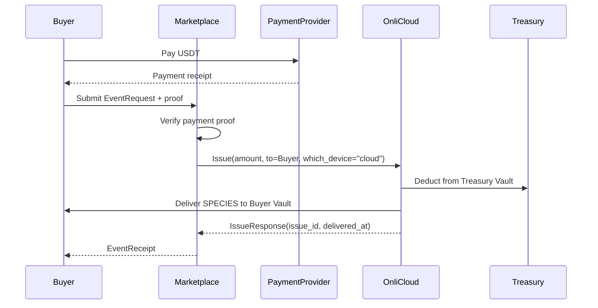
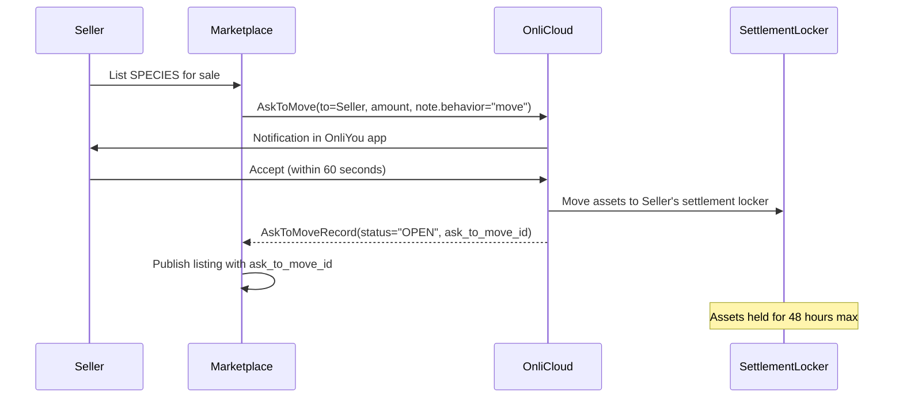
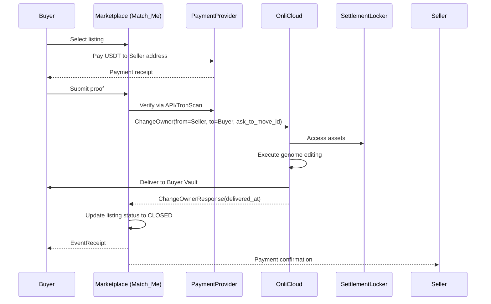
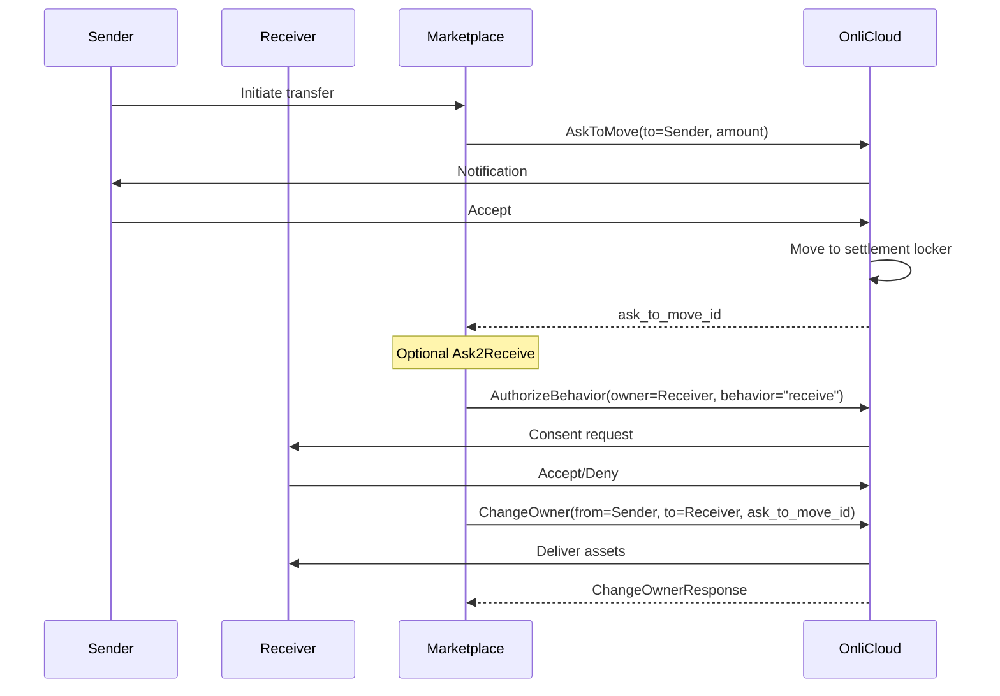
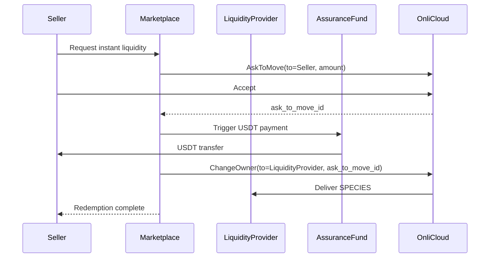

# SPECIES Marketplace - Onli Cloud Integration Update
## Aligning with Onli's Sovereign Asset Architecture

---

## Executive Summary

Based on the Onli Cloud API documentation, the SPECIES Marketplace leverages Onli's existing infrastructure for sovereign asset management. The key insight is that **Onli Cloud already provides the core asset movement primitives** - the marketplace simply orchestrates these to enable trading.

---

## 1. Core Architecture Alignment

### 1.1 Onli Cloud Services Used by SPECIES Marketplace

| Onli Service | SPECIES Usage | Purpose |
|-------------|---------------|---------|
| **Issue RPC** | Treasury operations | Mint new SPECIES from Treasury Vault |
| **AskToMove RPC** | Listing initiation | Request owner to move assets to settlement locker |
| **ChangeOwner RPC** | Trade execution | Transfer ownership after payment verified |
| **AuthenticateOwner RPC** | User verification | Confirm owner identity (60-second stream) |
| **AuthorizeBehavior RPC** | Permission grants | Authorize marketplace operations |
| **AuthLog RPC** | Audit trail | Track all marketplace transactions |
| **Oracle RPC** | Ownership verification | Verify final asset ownership |

### 1.2 Key Architectural Insights

1. **Settlement Locker Pattern**: Onli Cloud provides settlement lockers as temporary holding areas:
   - Assets remain in locker until ChangeOwner executes
   - Auto-return to owner if not used within settlement window (48 hours for marketplace)
   - Owner can view but not alter locker contents

2. **Two-Phase Movement**: All asset transfers require:
   - Phase 1: AskToMove (owner consent + move to locker)
   - Phase 2: ChangeOwner (execute ownership transfer)

3. **Stream-Based Authorization**: Real-time 60-second streams for:
   - Owner authentication
   - Behavior authorization
   - Move requests

---

## 2. Corrected Transaction Flows

### 2.1 ISSUE (Buy from Treasury)



**Key Points:**
- Direct issuance from Treasury to Buyer
- No intermediate locker needed
- $0.05 per genome issuance fee

### 2.2 LIST (Create Market Listing)



**Clarification on "Seller Onli_ID":**
- The settlement locker is **associated with the Seller's Onli_ID**
- This maintains ownership clarity - assets are still "owned" by seller
- Match_Me service has **permission** to execute ChangeOwner on these assets
- This design ensures seller maintains sovereignty until actual sale

### 2.3 BUY (Purchase from Listing)



### 2.4 TRANSFER (P2P)



### 2.5 REDEEM (Sell to Liquidity Provider)



---

## 3. Payment Verification Integration

### 3.1 NOWPayments Integration

```typescript
interface PaymentVerification {
  // Step 1: Create payment (for non-prepaid flows)
  createPayment(params: {
    price_amount: number;
    price_currency: "USDT";
    pay_currency: "USDT";
    order_id: string;  // eventId
  }): Promise<{
    payment_id: string;
    payment_url: string;
    pay_address: string;
  }>;

  // Step 2: Verify payment proof
  verifyPayment(payment_id: string): Promise<{
    payment_status: "waiting" | "confirming" | "confirmed" | "finished";
    price_amount: number;
    actually_paid: number;
    confirmations: number;  // Must be ≥12
  }>;
}
```

### 3.2 TronScan Verification (Direct)

```typescript
interface TronVerification {
  // For TRON network USDT transfers
  verifyTransaction(params: {
    tx_hash: string;
    from_address: string;
    to_address: string;
    amount: number;
  }): Promise<{
    confirmed: boolean;
    confirmations: number;
    timestamp: number;
  }>;
}
```

---

## 4. Critical Design Clarifications

### 4.1 Why Settlement Locker Uses Seller's Onli_ID

The settlement locker being associated with the **Seller's Onli_ID** (not Match_Me) is intentional:

1. **Sovereignty Preservation**: Assets remain under seller's identity
2. **Clear Ownership Trail**: Oracle shows seller → locker (seller) → buyer
3. **Consent Model**: Seller explicitly authorizes marketplace to act
4. **Recovery Path**: If trade fails, assets return to correct owner
5. **Audit Clarity**: Each step shows WHO owns assets

Match_Me acts as an **authorized agent**, not an owner.

### 4.2 Settlement Windows

| Operation | Window | Action on Timeout |
|-----------|--------|-------------------|
| AskToMove response | 60 seconds | Status: ASKED_EXPIRED |
| Listing duration | 48 hours | Assets return to seller |
| Payment verification | 10 minutes | Transaction cancelled |
| ChangeOwner execution | Within settlement window | Status: OPEN_EXPIRED |

### 4.3 Status Flow State Machine

```
ASKED → OPEN → CLOSED (success path)
   ↓      ↓       
DENIED  OPEN_EXPIRED → RETURNED
   ↓
ASKED_EXPIRED
```

---

## 5. Integration Requirements Update

### 5.1 Onli Cloud API Endpoints

```yaml
# Owners API (Onli ID Service)
base_url: https://api.onli.id/v1
endpoints:
  - CreateOwner
  - GetOwner
  - UpdateOwner
  - ListOwner

# Onli Cloud API (Asset Service)  
base_url: https://api.onlicloud.com/v1
endpoints:
  - Issue
  - AskToMove
  - ChangeOwner
  - AuthenticateOwner
  - AuthorizeBehavior
  - AuthLog
  - Oracle (RevealGenomes)
```

### 5.2 Required Credentials

```yaml
credentials:
  # From Appliance Registration
  user_id: "master_id"      # Master ID for your appliance
  app_key: "appliance_key"  # Appliance authentication key
  app_symbol: "SPECIES"     # Your registered app symbol
  
  # Service Accounts
  treasurer_onli_id: "usr-treasury-vault-system"
  match_me_onli_id: "service-match-me-[uuid]"
  liquidity_provider_onli_id: "service-lp-[uuid]"
```

### 5.3 Genome Configuration

```yaml
species_genome:
  genus: "denomination"  # Allows different face values
  face_values: 
    - one     # 1 SPECIES
    - kilo    # 1,000 SPECIES  
    - mega    # 1,000,000 SPECIES
  issuance_fee: 0.05  # USD per genome
```

---

## 6. Updated Service Architecture

### 6.1 Marketplace Services Mapping

| Original Service | Onli Cloud Integration | Role |
|-----------------|------------------------|------|
| Authenticator | AuthenticateOwner RPC | Owner identity verification |
| Validator | Payment provider APIs + TronScan | Payment proof verification |
| Classifier | Internal logic | Intent determination |
| Matching Service | AskToMove orchestration | Listing management |
| Cashier | Ledger + payment tracking | Financial records |
| Asset Manager | ChangeOwner RPC | Ownership transfers |
| Floor Manager | Oracle RPC | Final verification |
| Reporter | AuthLog RPC + internal | Audit and analytics |

### 6.2 Event Flow with Onli Cloud

```
User Action → Marketplace Orchestration → Onli Cloud RPC → Blockchain Verification → Response
     ↓                    ↓                      ↓                  ↓                    ↓
EventRequest    Validate & Route         Stream/Response    Proof/Confirmation    EventReceipt
```

---

## 7. Security & Compliance Updates

### 7.1 Multi-Layer Verification

1. **Identity Layer**: Onli Cloud AuthenticateOwner
2. **Authorization Layer**: AuthorizeBehavior for specific actions
3. **Payment Layer**: External blockchain verification
4. **Asset Layer**: Oracle verification of ownership
5. **Audit Layer**: AuthLog immutable records

### 7.2 No Custody Design Confirmed

- Marketplace NEVER holds assets directly
- Settlement lockers are Onli Cloud managed
- All movements require explicit owner consent
- Auto-return mechanisms prevent asset lock

---

## 8. Implementation Priorities

### Phase 1: Core Integration (Weeks 1-4)
- [ ] Onli Cloud API client implementation
- [ ] Authentication/Authorization flows
- [ ] Issue and Transfer operations
- [ ] Payment verification (NOWPayments + TronScan)

### Phase 2: Marketplace Features (Weeks 5-8)
- [ ] Listing management with AskToMove
- [ ] Buy/Sell flows with ChangeOwner
- [ ] Settlement locker monitoring
- [ ] Timeout handling

### Phase 3: Advanced Features (Weeks 9-12)
- [ ] Liquidity provider integration
- [ ] Oracle-based reporting
- [ ] AuthLog analytics
- [ ] Performance optimization

---

## 9. Key Takeaways

1. **Onli Cloud provides the infrastructure** - we orchestrate it
2. **Settlement lockers maintain sovereignty** - not escrow
3. **Every operation is two-phase** - consent then execute
4. **Match_Me is a service role** - not an owner
5. **48-hour listing window** - automatic return
6. **Payment verification is external** - NOWPayments/TronScan
7. **Genome editing is secure** - happens in TEE

---

## Next Steps

1. Update main PRD with correct Onli Cloud integration
2. Create detailed API client specifications
3. Define service account management
4. Implement timeout and recovery logic
5. Design monitoring for settlement windows
6. Build payment verification pipeline

---

**Document Version**: 3.0  
**Updated**: November 2024  
**Status**: Ready for Implementation
