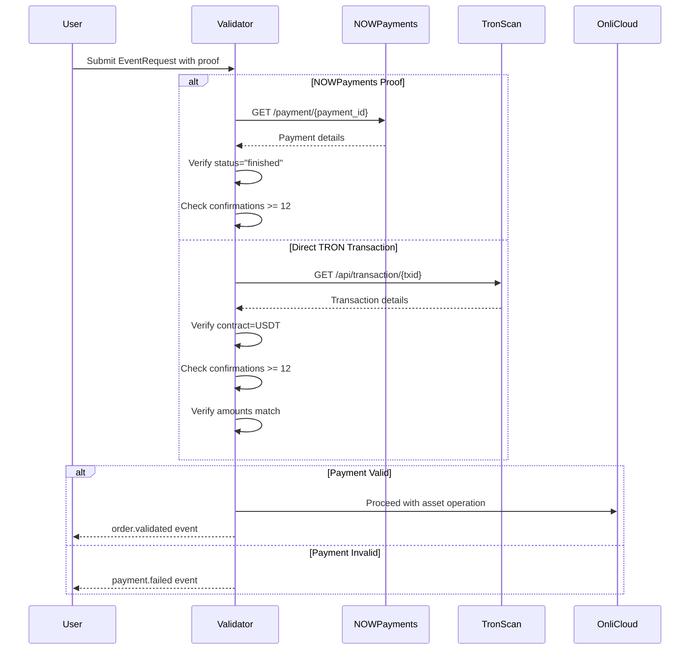

# SPECIES Marketplace - Validator Service Specification
## Payment Verification with NOWPayments and TRON

---

## 1. Validator Service Overview

The Validator is responsible for verifying USDT payment proofs before allowing any asset operations. It integrates with multiple payment verification methods:

```typescript
interface ValidatorService {
  // Primary verification methods
  verifyPaymentProof(proof: PaymentProof): Promise<ValidationResult>;
  verifyMatchProof(submission: MatchProofSubmission): Promise<PaymentConfirmation>;
  
  // Supported verification providers
  providers: {
    nowpayments: NOWPaymentsClient;
    tron: TronScanClient;
    ethereum: EtherscanClient;
    bsc: BscScanClient;
  };
}
```

---

## 2. Payment Verification Flow



---

## 3. NOWPayments Integration

### 3.1 Configuration

```yaml
nowpayments:
  api_url: "https://api.nowpayments.io/v1"
  api_key: ${NOW_API_KEY}
  api_secret: ${NOW_API_SECRET}
  
  supported_currencies:
    - USDT_TRC20  # TRON Network (preferred)
    - USDT_ERC20  # Ethereum
    - USDT_BEP20  # BSC
  
  validation_requirements:
    min_confirmations: 12
    payment_status: "finished"
    timeout_seconds: 600
```

### 3.2 Verification Implementation

```typescript
class NOWPaymentsVerifier {
  async verifyPayment(paymentId: string, expectedAmount: number): Promise<VerificationResult> {
    // Step 1: Fetch payment details
    const response = await fetch(`${this.apiUrl}/payment/${paymentId}`, {
      headers: {
        'x-api-key': this.apiKey
      }
    });
    
    const payment = await response.json();
    
    // Step 2: Validate payment status
    const validationChecks = {
      status_check: payment.payment_status === 'finished',
      amount_check: Math.abs(payment.price_amount - expectedAmount) < 0.01,
      currency_check: payment.price_currency === 'USDT',
      confirmation_check: this.getConfirmations(payment) >= 12,
      timestamp_check: this.isWithinTimeWindow(payment.created_at)
    };
    
    // Step 3: Return verification result
    return {
      valid: Object.values(validationChecks).every(check => check),
      payment_id: paymentId,
      actual_amount: payment.actually_paid,
      confirmations: this.getConfirmations(payment),
      network: this.detectNetwork(payment),
      checks: validationChecks
    };
  }
  
  private getConfirmations(payment: NOWPayment): number {
    // NOWPayments provides confirmation count
    return payment.confirmations || 0;
  }
  
  private detectNetwork(payment: NOWPayment): Chain {
    // Detect which blockchain network was used
    if (payment.pay_currency === 'usdttrc20') return 'TRON';
    if (payment.pay_currency === 'usdterc20') return 'ETH';
    if (payment.pay_currency === 'usdtbep20') return 'BSC';
    return 'UNKNOWN';
  }
}
```

---

## 4. TRON Direct Verification

### 4.1 TronScan Integration

```yaml
tron:
  api_url: "https://api.trongrid.io"
  backup_url: "https://api.tronscan.org"
  
  usdt_contract: "TR7NHqjeKQxGTCi8q8ZY4pL8otSzgjLj6t"  # USDT TRC20
  
  validation_requirements:
    min_confirmations: 12
    contract_accuracy: true
    amount_precision: 6  # USDT decimals
```

### 4.2 Direct TRON Verification

```typescript
class TronVerifier {
  async verifyTransaction(
    txHash: string, 
    fromAddress: string,
    toAddress: string,
    expectedAmount: number
  ): Promise<VerificationResult> {
    
    // Step 1: Fetch transaction from TronGrid
    const tx = await this.fetchTransaction(txHash);
    
    // Step 2: Decode contract data
    const decodedData = await this.decodeTRC20Transfer(tx);
    
    // Step 3: Validate transaction
    const validationChecks = {
      // Verify it's a USDT transfer
      contract_check: decodedData.contract === this.USDT_CONTRACT,
      
      // Verify sender and recipient
      from_check: decodedData.from === fromAddress,
      to_check: decodedData.to === toAddress,
      
      // Verify amount (handle decimals)
      amount_check: this.normalizeAmount(decodedData.value) === expectedAmount,
      
      // Verify confirmations
      confirmation_check: await this.getConfirmations(txHash) >= 12,
      
      // Verify transaction succeeded
      status_check: tx.ret[0].contractRet === 'SUCCESS',
      
      // Verify not expired
      timestamp_check: this.isWithinTimeWindow(tx.block_timestamp)
    };
    
    return {
      valid: Object.values(validationChecks).every(check => check),
      tx_hash: txHash,
      actual_amount: this.normalizeAmount(decodedData.value),
      confirmations: await this.getConfirmations(txHash),
      network: 'TRON',
      checks: validationChecks
    };
  }
  
  private async fetchTransaction(txHash: string): Promise<any> {
    const response = await fetch(
      `${this.apiUrl}/v1/transactions/${txHash}`
    );
    return response.json();
  }
  
  private async getConfirmations(txHash: string): Promise<number> {
    const tx = await this.fetchTransaction(txHash);
    const currentBlock = await this.getCurrentBlockNumber();
    return currentBlock - tx.blockNumber;
  }
  
  private normalizeAmount(value: string): number {
    // USDT has 6 decimals on TRON
    return parseInt(value) / 1_000_000;
  }
  
  private decodeTRC20Transfer(tx: any): TRC20Transfer {
    // Decode the contract data
    const data = tx.raw_data.contract[0].parameter.value;
    return {
      contract: data.contract_address,
      from: tronWeb.address.fromHex(data.owner_address),
      to: tronWeb.address.fromHex(data.to_address),
      value: data.amount || data.value
    };
  }
}
```

---

## 5. Unified Validator Implementation

```typescript
export class ValidatorService {
  private nowPayments: NOWPaymentsVerifier;
  private tronVerifier: TronVerifier;
  private ethVerifier: EthereumVerifier;
  private bscVerifier: BSCVerifier;
  
  async validatePaymentProof(
    eventRequest: EventRequest
  ): Promise<OrderValidated | PaymentFailed> {
    
    const { payWith } = eventRequest;
    
    if (!payWith?.proof) {
      return this.createPaymentFailed(eventRequest.eventId, 'proof.missing');
    }
    
    try {
      let verificationResult: VerificationResult;
      
      // Determine verification method based on proof format
      if (this.isNOWPaymentId(payWith.proof)) {
        // NOWPayments verification
        verificationResult = await this.nowPayments.verifyPayment(
          payWith.proof,
          eventRequest.amount * this.getUSDTPrice()
        );
      } else if (this.isTronTxHash(payWith.proof)) {
        // Direct TRON verification
        verificationResult = await this.tronVerifier.verifyTransaction(
          payWith.proof,
          this.extractFromAddress(eventRequest),
          this.getPaymentDestination(eventRequest),
          eventRequest.amount * this.getUSDTPrice()
        );
      } else {
        return this.createPaymentFailed(eventRequest.eventId, 'proof.invalid_format');
      }
      
      // Check verification result
      if (!verificationResult.valid) {
        const failureReason = this.determineFailureReason(verificationResult.checks);
        return this.createPaymentFailed(eventRequest.eventId, failureReason);
      }
      
      // Payment is valid
      return {
        topic: 'order.validated',
        eventId: eventRequest.eventId,
        mode: this.determineMode(eventRequest),
        prepaid: true,
        evidence: {
          proof: payWith.proof,
          network: verificationResult.network,
          confirmations: verificationResult.confirmations,
          amount_usdt: verificationResult.actual_amount
        },
        ts: new Date().toISOString()
      };
      
    } catch (error) {
      console.error('Payment verification error:', error);
      return this.createPaymentFailed(eventRequest.eventId, 'verification.error');
    }
  }
  
  private isNOWPaymentId(proof: string): boolean {
    // NOWPayments IDs follow pattern: npmt_[alphanumeric]
    return /^npmt_[a-zA-Z0-9]+$/.test(proof);
  }
  
  private isTronTxHash(proof: string): boolean {
    // TRON transaction hashes are 64 character hex strings
    return /^[a-f0-9]{64}$/i.test(proof);
  }
  
  private determineFailureReason(checks: any): string {
    if (!checks.confirmation_check) return 'insufficient.confirmations';
    if (!checks.amount_check) return 'amount.mismatch';
    if (!checks.status_check) return 'payment.not.complete';
    if (!checks.contract_check) return 'invalid.token';
    return 'validation.failed';
  }
}
```

---

## 6. Configuration & Deployment

### 6.1 Environment Variables

```bash
# NOWPayments Configuration
NOW_API_KEY=your_nowpayments_api_key
NOW_API_SECRET=your_nowpayments_api_secret
NOW_WEBHOOK_SECRET=your_webhook_secret

# TRON Configuration  
TRON_API_KEY=your_trongrid_api_key
TRON_NETWORK=mainnet
USDT_CONTRACT_ADDRESS=TR7NHqjeKQxGTCi8q8ZY4pL8otSzgjLj6t

# Validation Requirements
MIN_CONFIRMATIONS=12
MAX_PAYMENT_AGE_MINUTES=60
PAYMENT_TOLERANCE_PERCENT=0.1
```

### 6.2 Webhook Handler for NOWPayments

```typescript
app.post('/webhooks/nowpayments', async (req, res) => {
  // Verify webhook signature
  const signature = req.headers['x-nowpayments-sig'];
  if (!verifyWebhookSignature(req.body, signature, WEBHOOK_SECRET)) {
    return res.status(401).send('Invalid signature');
  }
  
  const payment = req.body;
  
  // Handle payment status updates
  if (payment.payment_status === 'finished') {
    // Find pending order with this payment_id
    const order = await findOrderByPaymentId(payment.payment_id);
    
    if (order) {
      // Emit payment confirmation event
      await eventBus.emit({
        topic: 'payment.confirmed',
        eventId: order.eventId,
        paymentId: payment.payment_id,
        amount: payment.actually_paid,
        currency: 'USDT',
        confirmations: payment.confirmations,
        ts: new Date().toISOString()
      });
    }
  }
  
  res.status(200).send('OK');
});
```

---

## 7. Key Features

1. **Dual Verification Path**: Supports both payment processor (NOWPayments) and direct blockchain verification (TronScan)

2. **Multi-Chain Support**: TRON (preferred), Ethereum, BSC

3. **Robust Validation**:
   - Minimum 12 confirmations
   - Amount verification with tolerance
   - Contract address validation
   - Timestamp freshness checks

4. **Failover Capability**: If NOWPayments is down, can verify directly on-chain

5. **Audit Trail**: All verification attempts logged with detailed check results

---

## Summary

The Validator service provides comprehensive payment verification through:
- **NOWPayments API** for processor-managed payments
- **Direct TRON/TronScan** verification for on-chain payments
- **Unified interface** that abstracts verification method
- **Strict validation** requiring 12+ confirmations
- **Complete audit trail** of all verification attempts

This ensures that every SPECIES transaction is backed by verified USDT payment before any assets move.
