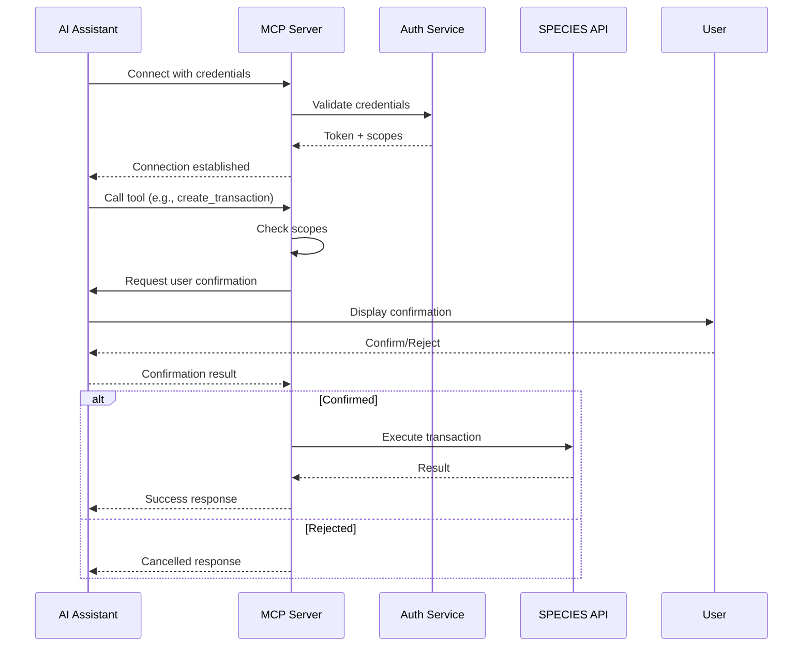

# SPECIES Model Context Protocol (MCP) Specification
## Version 1.0

---

## 1. Overview

The SPECIES MCP enables AI models to interact with the SPECIES Marketplace, providing capabilities for querying balances, initiating transactions, checking market conditions, and managing digital assets within the Onli ecosystem. This protocol follows the Model Context Protocol standard for secure, standardized AI-to-marketplace communication.

### 1.1 Purpose

This MCP allows AI assistants to:
- Query SPECIES balances and transaction history
- Initiate and monitor transactions (with user confirmation)
- Provide market analytics and pricing information
- Manage listings and orders
- Access user statements and receipts
- Interact with the Onli Cloud ecosystem

### 1.2 Design Principles

- **User Sovereignty**: All actions require explicit user consent
- **Read-Heavy**: Most operations are read-only for safety
- **Confirmation Required**: Write operations require multi-step confirmation
- **Audit Trail**: All operations are logged and traceable
- **Rate Limited**: Prevents abuse and ensures fair usage

---

## 2. Protocol Specification

### 2.1 Connection Configuration

```json
{
  "protocol": "mcp",
  "version": "1.0.0",
  "capabilities": {
    "resources": true,
    "tools": true,
    "prompts": true,
    "sampling": false
  },
  "server": {
    "name": "species-marketplace-mcp",
    "version": "1.0.0",
    "description": "SPECIES Marketplace MCP Server"
  }
}
```

### 2.2 Authentication

```typescript
interface MCPAuthentication {
  type: "oauth2" | "api_key";
  credentials: {
    clientId?: string;
    clientSecret?: string;
    apiKey?: string;
    profileTrayToken?: string;
  };
  scopes: string[];
}

// Available scopes
enum MCPScopes {
  READ_BALANCE = "balance:read",
  READ_TRANSACTIONS = "transactions:read",
  READ_MARKET = "market:read",
  WRITE_TRANSACTION = "transactions:write",
  WRITE_LISTING = "listings:write",
  ADMIN_REPORTS = "reports:admin"
}
```

---

## 3. Resources

Resources provide read-only access to SPECIES Marketplace data.

### 3.1 Balance Resource

```typescript
{
  "uri": "species://balance/{userId}",
  "name": "User Balance",
  "description": "Get SPECIES and USDT balances for a user",
  "mimeType": "application/json",
  "schema": {
    "type": "object",
    "properties": {
      "userId": { "type": "string" },
      "balances": {
        "type": "object",
        "properties": {
          "species": { "type": "number" },
          "usdt": { "type": "number" },
          "lockedSpecies": { "type": "number" }
        }
      },
      "lastUpdated": { "type": "string", "format": "date-time" }
    }
  }
}
```

### 3.2 Market Data Resource

```typescript
{
  "uri": "species://market/overview",
  "name": "Market Overview",
  "description": "Current market conditions and statistics",
  "mimeType": "application/json",
  "schema": {
    "type": "object",
    "properties": {
      "currentPrice": { "type": "number" },
      "24hVolume": { "type": "number" },
      "24hChange": { "type": "number" },
      "activeListings": { "type": "integer" },
      "treasurySupply": { "type": "number" },
      "circulatingSupply": { "type": "number" }
    }
  }
}
```

### 3.3 Transaction History Resource

```typescript
{
  "uri": "species://transactions/{userId}?limit={limit}&offset={offset}",
  "name": "Transaction History",
  "description": "User's transaction history",
  "mimeType": "application/json",
  "schema": {
    "type": "object",
    "properties": {
      "transactions": {
        "type": "array",
        "items": {
          "type": "object",
          "properties": {
            "eventId": { "type": "string" },
            "type": { "enum": ["BUY", "SELL", "TRANSFER", "ISSUE"] },
            "amount": { "type": "number" },
            "status": { "enum": ["PENDING", "COMPLETED", "FAILED"] },
            "timestamp": { "type": "string", "format": "date-time" },
            "counterparty": { "type": "string" },
            "fees": { "type": "number" }
          }
        }
      },
      "pagination": {
        "type": "object",
        "properties": {
          "total": { "type": "integer" },
          "limit": { "type": "integer" },
          "offset": { "type": "integer" },
          "hasNext": { "type": "boolean" }
        }
      }
    }
  }
}
```

### 3.4 Listings Resource

```typescript
{
  "uri": "species://listings/active",
  "name": "Active Listings",
  "description": "Current marketplace listings",
  "mimeType": "application/json",
  "schema": {
    "type": "object",
    "properties": {
      "listings": {
        "type": "array",
        "items": {
          "type": "object",
          "properties": {
            "listingId": { "type": "string" },
            "sellerId": { "type": "string" },
            "amount": { "type": "number" },
            "pricePerUnit": { "type": "number" },
            "totalPrice": { "type": "number" },
            "createdAt": { "type": "string", "format": "date-time" },
            "expiresAt": { "type": "string", "format": "date-time" }
          }
        }
      }
    }
  }
}
```

---

## 4. Tools

Tools provide interactive capabilities with confirmation requirements.

### 4.1 Check Balance Tool

```typescript
{
  "name": "species_check_balance",
  "description": "Check SPECIES and USDT balances for the authenticated user",
  "inputSchema": {
    "type": "object",
    "properties": {
      "currency": {
        "type": "string",
        "enum": ["SPECIES", "USDT", "ALL"],
        "default": "ALL"
      },
      "includeLockedFunds": {
        "type": "boolean",
        "default": true
      }
    }
  },
  "confirmation": {
    "required": false,
    "type": "none"
  }
}
```

### 4.2 Estimate Transaction Tool

```typescript
{
  "name": "species_estimate_transaction",
  "description": "Estimate fees and total cost for a transaction",
  "inputSchema": {
    "type": "object",
    "required": ["type", "amount"],
    "properties": {
      "type": {
        "type": "string",
        "enum": ["BUY_TREASURY", "BUY_MARKET", "SELL_MARKET", "TRANSFER"]
      },
      "amount": {
        "type": "number",
        "minimum": 1
      },
      "listingId": {
        "type": "string",
        "description": "Required for BUY_MARKET"
      },
      "recipient": {
        "type": "string",
        "description": "Required for TRANSFER"
      }
    }
  },
  "confirmation": {
    "required": false,
    "type": "none"
  }
}
```

### 4.3 Create Transaction Tool

```typescript
{
  "name": "species_create_transaction",
  "description": "Create a new SPECIES transaction (requires confirmation)",
  "inputSchema": {
    "type": "object",
    "required": ["type", "amount"],
    "properties": {
      "type": {
        "type": "string",
        "enum": ["BUY_TREASURY", "BUY_MARKET", "SELL_MARKET", "TRANSFER"]
      },
      "amount": {
        "type": "number",
        "minimum": 1
      },
      "paymentProof": {
        "type": "string",
        "description": "Payment proof for prepaid model"
      },
      "recipient": {
        "type": "string",
        "description": "For TRANSFER type"
      },
      "listingId": {
        "type": "string",
        "description": "For BUY_MARKET type"
      },
      "putProceeds": {
        "type": "object",
        "properties": {
          "usdtAddress": { "type": "string" },
          "chain": { "enum": ["TRON", "ETH", "BSC"] }
        }
      }
    }
  },
  "confirmation": {
    "required": true,
    "type": "user_consent",
    "message": "Confirm transaction of {amount} SPECIES ({type}). This action cannot be reversed.",
    "requiresPIN": true,
    "timeout": 60
  }
}
```

### 4.4 Create Listing Tool

```typescript
{
  "name": "species_create_listing",
  "description": "Create a marketplace listing (requires listing fee)",
  "inputSchema": {
    "type": "object",
    "required": ["amount", "pricePerUnit"],
    "properties": {
      "amount": {
        "type": "number",
        "minimum": 5000,
        "description": "Minimum 5000 SPECIES"
      },
      "pricePerUnit": {
        "type": "number",
        "minimum": 0.001,
        "description": "Price in USDT per SPECIES"
      },
      "duration": {
        "type": "integer",
        "default": 172800,
        "maximum": 604800,
        "description": "Duration in seconds (default 48 hours)"
      },
      "feeProof": {
        "type": "string",
        "description": "Proof of $100 USDT listing fee payment"
      }
    }
  },
  "confirmation": {
    "required": true,
    "type": "user_consent",
    "message": "Create listing for {amount} SPECIES at {pricePerUnit} USDT each. Listing fee: $100 USDT.",
    "requiresPIN": true
  }
}
```

### 4.5 Get Receipt Tool

```typescript
{
  "name": "species_get_receipt",
  "description": "Retrieve transaction receipt",
  "inputSchema": {
    "type": "object",
    "required": ["eventId"],
    "properties": {
      "eventId": {
        "type": "string",
        "description": "Transaction event ID"
      },
      "format": {
        "type": "string",
        "enum": ["json", "pdf", "html"],
        "default": "json"
      }
    }
  },
  "confirmation": {
    "required": false,
    "type": "none"
  }
}
```

### 4.6 Monitor Transaction Tool

```typescript
{
  "name": "species_monitor_transaction",
  "description": "Monitor transaction status in real-time",
  "inputSchema": {
    "type": "object",
    "required": ["eventId"],
    "properties": {
      "eventId": {
        "type": "string",
        "description": "Transaction event ID to monitor"
      },
      "includeUpdates": {
        "type": "boolean",
        "default": true,
        "description": "Stream real-time updates"
      }
    }
  },
  "confirmation": {
    "required": false,
    "type": "none"
  }
}
```

---

## 5. Prompts

Pre-configured prompts for common SPECIES operations.

### 5.1 Market Analysis Prompt

```typescript
{
  "name": "species_market_analysis",
  "description": "Analyze current SPECIES market conditions",
  "arguments": [
    {
      "name": "timeframe",
      "description": "Analysis timeframe",
      "required": false,
      "default": "24h"
    }
  ],
  "template": `Analyze the SPECIES market for the {timeframe} timeframe:

1. Check current market overview
2. Get active listings summary
3. Calculate average prices
4. Identify trends
5. Provide trading recommendations

Focus on:
- Price movements
- Volume analysis
- Supply/demand balance
- Optimal entry/exit points`
}
```

### 5.2 Transaction Assistant Prompt

```typescript
{
  "name": "species_transaction_assistant",
  "description": "Help user complete a SPECIES transaction",
  "arguments": [
    {
      "name": "transactionType",
      "description": "Type of transaction",
      "required": true
    },
    {
      "name": "amount",
      "description": "Amount of SPECIES",
      "required": false
    }
  ],
  "template": `Assist with {transactionType} transaction:

1. Check user's current balance
2. Estimate transaction costs and fees
3. Verify market conditions
4. Guide through confirmation process
5. Monitor transaction completion

Ensure user understands:
- Total costs involved
- Irreversibility of transactions
- Current market conditions
- Expected completion time`
}
```

### 5.3 Portfolio Overview Prompt

```typescript
{
  "name": "species_portfolio_overview",
  "description": "Comprehensive portfolio analysis",
  "template": `Provide complete SPECIES portfolio overview:

1. Current balances (SPECIES and USDT)
2. Recent transaction history
3. Active listings or orders
4. Performance metrics
5. Recommendations

Calculate:
- Total portfolio value
- P&L if applicable
- Transaction frequency
- Average transaction size`
}
```

---

## 6. Safety and Confirmation Flows

### 6.1 Confirmation Levels

```typescript
enum ConfirmationLevel {
  NONE = "none",                    // Read-only operations
  NOTIFICATION = "notification",    // User notified, no confirmation needed
  USER_CONSENT = "user_consent",    // Explicit user confirmation required
  TWO_FACTOR = "two_factor"        // Requires 2FA/PIN confirmation
}

interface ConfirmationFlow {
  level: ConfirmationLevel;
  message: string;
  timeout?: number;                 // Seconds before timeout
  requiresPIN?: boolean;
  requiresReauthentication?: boolean;
  showTransactionPreview?: boolean;
}
```

### 6.2 Transaction Preview

```typescript
interface TransactionPreview {
  type: string;
  amount: number;
  estimatedFees: {
    listing?: number;
    issuance?: number;
    liquidity?: number;
    total: number;
  };
  estimatedCompletion: string;
  currentBalance: number;
  resultingBalance: number;
  risks: string[];
  requiresProof: boolean;
}
```

### 6.3 Rate Limiting

```typescript
interface RateLimits {
  global: {
    requestsPerMinute: 60;
    requestsPerHour: 1000;
  };
  perTool: {
    "species_check_balance": { rpm: 30 };
    "species_create_transaction": { rpm: 5, dailyLimit: 50 };
    "species_create_listing": { rpm: 2, dailyLimit: 10 };
    "species_estimate_transaction": { rpm: 20 };
  };
  perUser: {
    transactionsPerDay: 100;
    listingsPerDay: 10;
    maxTransactionAmount: 1000000;
  };
}
```

---

## 7. Error Handling

### 7.1 Error Response Format

```typescript
interface MCPError {
  code: string;
  message: string;
  details?: {
    eventId?: string;
    timestamp: string;
    retryable: boolean;
    retryAfter?: number;
    userMessage?: string;
  };
}

enum ErrorCodes {
  // Authentication errors
  AUTH_INVALID_CREDENTIALS = "AUTH001",
  AUTH_EXPIRED_TOKEN = "AUTH002",
  AUTH_INSUFFICIENT_SCOPE = "AUTH003",
  
  // Validation errors
  VALIDATION_INVALID_AMOUNT = "VAL001",
  VALIDATION_INSUFFICIENT_BALANCE = "VAL002",
  VALIDATION_INVALID_RECIPIENT = "VAL003",
  VALIDATION_BELOW_MINIMUM = "VAL004",
  
  // Market errors
  MARKET_LISTING_NOT_FOUND = "MKT001",
  MARKET_LISTING_EXPIRED = "MKT002",
  MARKET_INSUFFICIENT_LIQUIDITY = "MKT003",
  
  // Transaction errors
  TRANSACTION_PROOF_INVALID = "TXN001",
  TRANSACTION_TIMEOUT = "TXN002",
  TRANSACTION_FAILED = "TXN003",
  
  // Rate limit errors
  RATE_LIMIT_EXCEEDED = "RATE001",
  DAILY_LIMIT_REACHED = "RATE002",
  
  // System errors
  SYSTEM_UNAVAILABLE = "SYS001",
  SYSTEM_MAINTENANCE = "SYS002"
}
```

### 7.2 Error Recovery

```typescript
interface ErrorRecovery {
  strategies: {
    AUTH_EXPIRED_TOKEN: {
      action: "refresh_token";
      automatic: true;
    };
    RATE_LIMIT_EXCEEDED: {
      action: "exponential_backoff";
      automatic: true;
      maxRetries: 3;
    };
    VALIDATION_INSUFFICIENT_BALANCE: {
      action: "suggest_deposit";
      automatic: false;
    };
    TRANSACTION_TIMEOUT: {
      action: "retry_with_new_proof";
      automatic: false;
      userPrompt: true;
    };
  };
}
```

---

## 8. Implementation Examples

### 8.1 Server Implementation (Node.js)

```typescript
import { MCPServer } from '@modelcontextprotocol/sdk';
import { SpeciesMarketplaceClient } from './species-client';

class SpeciesMCPServer extends MCPServer {
  private speciesClient: SpeciesMarketplaceClient;
  
  constructor() {
    super({
      name: "species-marketplace-mcp",
      version: "1.0.0",
      capabilities: {
        resources: true,
        tools: true,
        prompts: true
      }
    });
    
    this.speciesClient = new SpeciesMarketplaceClient();
    this.registerHandlers();
  }
  
  private registerHandlers() {
    // Register resources
    this.registerResource('species://balance/*', this.handleBalanceResource);
    this.registerResource('species://market/*', this.handleMarketResource);
    
    // Register tools
    this.registerTool('species_check_balance', this.handleCheckBalance);
    this.registerTool('species_create_transaction', this.handleCreateTransaction);
    
    // Register prompts
    this.registerPrompt('species_market_analysis', this.marketAnalysisPrompt);
  }
  
  private async handleCheckBalance(params: any) {
    const { currency, includeLockedFunds } = params;
    
    try {
      const balance = await this.speciesClient.getBalance({
        currency,
        includeLockedFunds
      });
      
      return {
        success: true,
        data: balance
      };
    } catch (error) {
      return this.handleError(error);
    }
  }
  
  private async handleCreateTransaction(params: any) {
    // Require confirmation
    const confirmed = await this.requestConfirmation({
      level: 'USER_CONSENT',
      message: `Confirm transaction of ${params.amount} SPECIES`,
      requiresPIN: true
    });
    
    if (!confirmed) {
      throw new Error('Transaction cancelled by user');
    }
    
    // Create transaction
    const result = await this.speciesClient.createTransaction(params);
    
    // Start monitoring
    this.monitorTransaction(result.eventId);
    
    return result;
  }
}
```

### 8.2 Client Usage Example

```typescript
import { MCPClient } from '@modelcontextprotocol/sdk';

async function useSpeciesMCP() {
  const client = new MCPClient({
    serverUrl: 'species://localhost:3000',
    authentication: {
      type: 'api_key',
      credentials: {
        apiKey: process.env.SPECIES_API_KEY,
        profileTrayToken: process.env.PROFILETRAY_TOKEN
      }
    }
  });
  
  // Connect to server
  await client.connect();
  
  // Check balance
  const balance = await client.callTool('species_check_balance', {
    currency: 'ALL'
  });
  
  console.log('Current balance:', balance);
  
  // Estimate transaction
  const estimate = await client.callTool('species_estimate_transaction', {
    type: 'BUY_TREASURY',
    amount: 1000
  });
  
  console.log('Transaction estimate:', estimate);
  
  // Create transaction (will request confirmation)
  const transaction = await client.callTool('species_create_transaction', {
    type: 'BUY_TREASURY',
    amount: 1000,
    paymentProof: 'npmt_xyz123'
  });
  
  console.log('Transaction created:', transaction);
}
```

---

## 9. Security Considerations

### 9.1 Authentication Flow



### 9.2 Security Best Practices

1. **Never store credentials**: Always use secure token management
2. **Scope limitation**: Request minimum necessary scopes
3. **Confirmation for writes**: All write operations require explicit confirmation
4. **Rate limiting**: Prevent abuse and accidental loops
5. **Audit logging**: Log all operations for compliance
6. **Encryption**: All communications must use TLS
7. **Token rotation**: Regular token refresh and rotation
8. **Input validation**: Strict validation of all inputs
9. **Output sanitization**: Prevent injection attacks
10. **Error masking**: Don't leak sensitive information in errors

---

## 10. Monitoring and Analytics

### 10.1 Metrics to Track

```typescript
interface MCPMetrics {
  usage: {
    totalRequests: number;
    requestsByTool: Record<string, number>;
    requestsByUser: Record<string, number>;
    averageLatency: number;
    errorRate: number;
  };
  
  transactions: {
    initiated: number;
    confirmed: number;
    completed: number;
    failed: number;
    averageAmount: number;
    totalVolume: number;
  };
  
  safety: {
    confirmationsRequested: number;
    confirmationsAccepted: number;
    confirmationsRejected: number;
    rateLimitHits: number;
    authenticationFailures: number;
  };
}
```

### 10.2 Logging Format

```json
{
  "timestamp": "2024-11-05T12:00:00Z",
  "level": "INFO",
  "service": "species-mcp",
  "userId": "usr-123",
  "sessionId": "sess-456",
  "tool": "species_create_transaction",
  "parameters": {
    "type": "BUY_TREASURY",
    "amount": 1000
  },
  "result": "success",
  "latency": 1234,
  "metadata": {
    "eventId": "evt-789",
    "confirmationRequired": true,
    "confirmationReceived": true
  }
}
```

---

## Appendix A: Quick Reference

### Available Tools
- `species_check_balance` - Check balances
- `species_estimate_transaction` - Estimate costs
- `species_create_transaction` - Create transaction ⚠️
- `species_create_listing` - Create listing ⚠️
- `species_get_receipt` - Get receipt
- `species_monitor_transaction` - Monitor status

### Available Resources
- `species://balance/{userId}` - User balances
- `species://market/overview` - Market data
- `species://transactions/{userId}` - Transaction history
- `species://listings/active` - Active listings

### Confirmation Required Operations
- Create transaction
- Create listing
- Cancel listing
- Modify order

---

## Version History

- **1.0.0** (November 2024) - Initial MCP specification
  - Core tools and resources
  - Safety and confirmation flows
  - Error handling
  - Security framework

---

**Specification Status**: Ready for Implementation  
**Protocol Version**: MCP 1.0  
**SPECIES Integration**: v4.1
